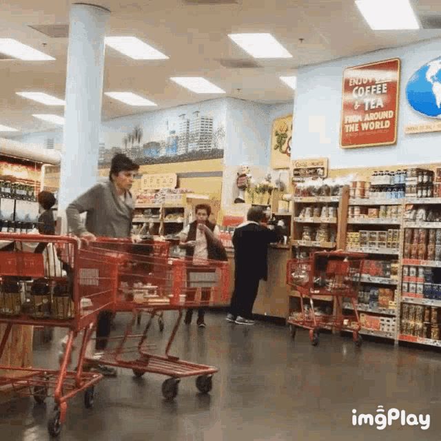

#   ESPAÑOL:

## <i align="center" style="font-size:2rem">💼 SMART SHOPPING (COMERCIO ELECTRONICO)</i>
En este proyecto se usaron hooks como **useState,useEffect,useContext,useReducer** , tenologias como  **HTML,CSS,JavaScript,React,SASS** y para el manejo de rutas **React Router**

 _Este proyecto fue construido con el proposito de practicar React_

**Nota: Es responsivo**

## 💡 Como se penso este proyecto y como funciona

**_Idea Principal: Un Ecommerce_**

La api que se utilizo fue : 
- [DummyJSON](https://dummyjson.com/products)

Es importante decir que a este proyecto le dedique bastante tiempo y considero que fue muy util para mi aprendizaje . Ademas estoy muy feliz por como quedo terminado .

Principalmente decir que a traves de un contexto manejo los diferentes estados que posee el ecommerce.Los estados que hay en el contexto son principalmente :
- El estado que posee los productos tambien llamado **_"Products"_** (estos productos se obtienen al momento de cargar la aplicacion)
- El estado de los filtros de las diferentes categorias/precio de los productos llamado **_"Filters"_**
- El estado para saber en que producto el usuario hizo click para saber mas de el **_"ProductSelected"_**
- El estado para saber la cantidad de productos en el carrito y el subtotal llamado **_"aditionalInfo"_**
- El estado para saber los productos favoritos del usuario llamado **_"favorite"_** 
- El estado para manejar las modales de añadir al carrito **_"modalAdd"_**

A traves de un Reducer manejo el estado del carrito. Las diferentes acciones del carrito incluyen : Añadir producto al carrito , eliminar producto del carrito y limpiar el carrito.

Añadi persistencia de datos a traves del local storage tanto para los productos que posee el usuario en el carrito y en favoritos

La aplicacion posee diferentes paginas:
- La principal llamada HOME
- La pagina de CONTACTO
- La pagina de los productos
- La pagina individual de cada producto
- La pagina de los productos favoritos
- La pagina del carrito
- La pagina del error 404

Los productos que utilice en esta aplicacion los obtuve de DUMMYJASON , copie el JSON  de los productos y lo guarde en un archivo JSON, ya que asi me resulto mucho mas facil de trabajar , podria agregarle en el futuro obtener los productos directamente a traves de una peticion al endpoint de su API.

Los estilos los realice con SASS , considero que es una herramienta muy eficiente y me ayuda a desarrollar mas rapido los estilos
-----------------------------------------------------------------------------------
-----------------------------------------------------------------------------------

#  ENGLISH:

## <i align="center" style="font-size:2rem">💰 SMART SHOPPING (E-COMMERCE)</i>

En este proyecto se usaron hooks como **useState,useEffect,useContext** , tenologias como  **HTML,CSS,JavaScript,React,SASS** y para el manejo de rutas **React Router**

 _This project was built to practising React_

**Note: It´s responsive**

## 🤔 How this project was thinked and how it works

**_Main Idea: An Ecommerce_**

The API used was : 
- [DummyJSON](https://dummyjson.com/products)

It´s important to say that at this project I dedicated a lot of time and I consider that It was very useful to my learn

Mainly say that throught a Context the app handle the different states that has the ecommerce. The states that context has are:
- The state that has the products ,called **_"Products"_** (These products were got at the moment to load the app)
- The filter state of the differents products categories/prices ,called **_"Filters"_**
- The state to know in what product the user clicks, called **_"ProductSelected"_**
- The state to know the number of products in the cart and the total, called **_"aditionalInfo"_**
- The state to know the user´s favorite products , called **_"favorite"_** 
- The state to handle the cart modals , called **_"modalAdd"_**

Trought a reducer ,the app manages the state of the cart. The different actions of the cart are: Add to cart, delete from cart and clean cart.

I have added data persistance of cart products and favorite products via local storage .

The application has different views/pages:
- The main page HOME
- The contact page
- The products page
- The individual products page
- The favorite products page
- The cart page
- The Error 404 page

The products that I used I got by DUMMYJSON. I copied products JSON and I save it in a file . For me It was the easy form to work . In the future I will get the products via fetch to the API

I did the styles with SASS, I think its a very powerful and efficient tool , It helped me a lot of to develop more faster.
